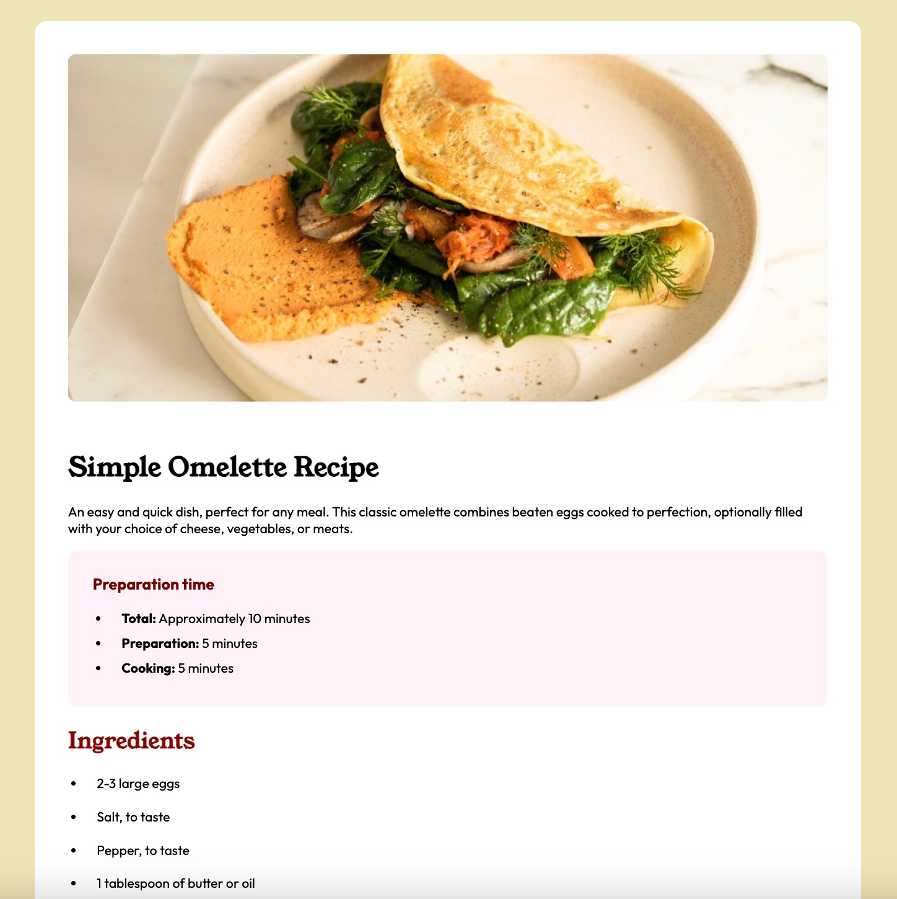

# 🥞 Recipe Page – Frontend Mentor Challenge

A clean, responsive recipe page built with HTML and CSS. This project is part of the [Frontend Mentor](https://www.frontendmentor.io) challenges, aimed at improving frontend development skills through real-world projects.

## 📸 Preview



➡️ Live site: https://dzik0.github.io/recipe-page/

## 🚀 Features

- Fully responsive layout
- Styled using custom CSS and Google Fonts
- Semantic HTML for accessibility
- Nutritional information table
- Preparation time breakdown
- Simple and attractive UI

## 🛠️ Tech Stack

- HTML5
- CSS3
- Google Fonts: _Young Serif_, _Outfit_

## 📂 Project Structure

```
├── index.html
├── main.css
├── assets/
│   └── images/
│       ├── image-omelette.jpeg
│       └── favicon-32x32.png
```

## 📋 Setup Instructions

1. Clone the repository:

```bash
git clone https://github.com/your-username/recipe-page.git
```

2. Navigate to the project folder:

```bash
cd recipe-page
```

3. Open `index.html` in your browser to view the recipe page.

## ✅ Challenge Info

This challenge is from Frontend Mentor and focuses on converting a design into code using just HTML and CSS.

- Challenge Link: [Recipe page on Frontend Mentor](https://www.frontendmentor.io/challenges/recipe-page-Bekx8dY5N)

## 🙌 Acknowledgements

- Design by [Frontend Mentor](https://www.frontendmentor.io)
- Fonts by [Google Fonts](https://fonts.google.com/)

## 📄 License

This project is licensed under the MIT License.
